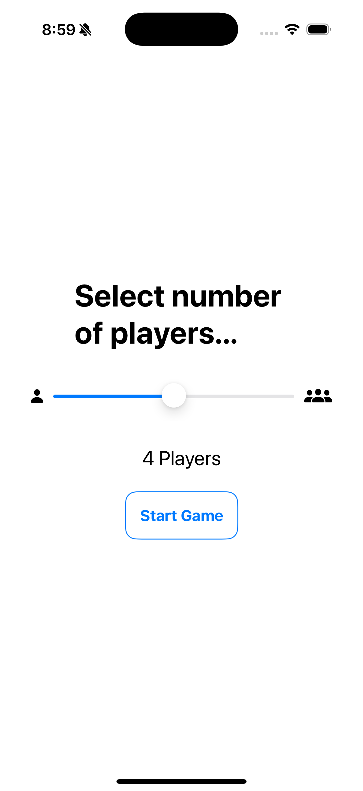
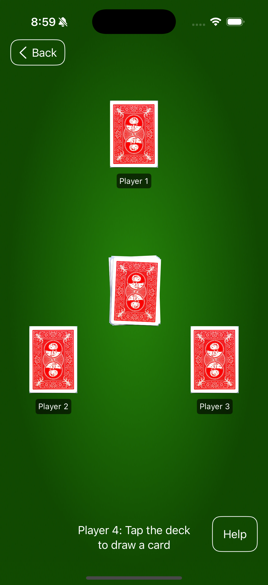
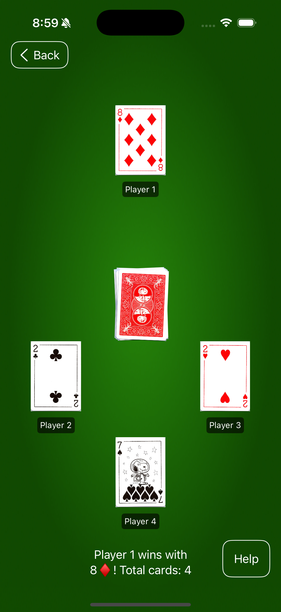
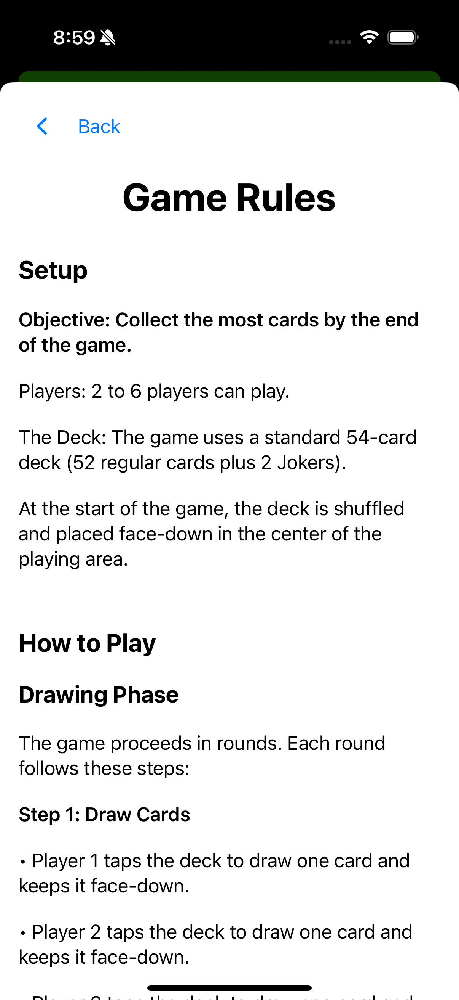
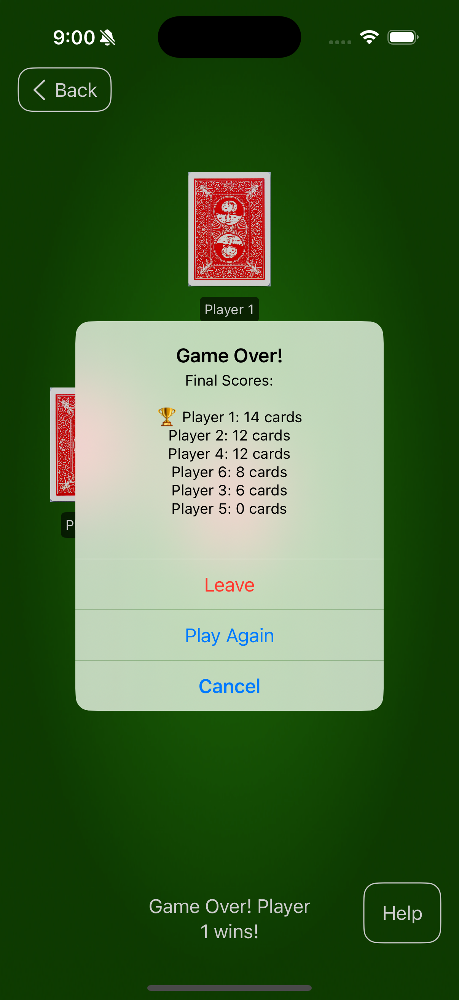

# Card War

**Card War** is an iOS app that reimagines the classic card game for mobile devices. Experience smooth animations, automatic scoring, and support for 2-6 players in this competitive card battle game.

> _This project was created as part of **Mobile Programming 3326 (Fall 2025)** at **St. Edward's University**._

## Overview

**Card War** brings the fast paced card game to life in your hand. Players take turns drawing cards from a central deck, and the highest card wins the round. When players tie with matching high cards, the game enters "War," automatically handling tie-breakers with dramatic flair.

The app handles all game logic, from special card rules (Jokers beat everything, Aces beat Kings when Kings are in play) to multi-round wars, letting players focus on the excitement of each reveal.

## Features

- **2-6 Player Support**
  - Dynamic card positioning that adapts to player count
  - Clear player labels and turn indicators
  - Real-time score tracking for all players

- **Smooth Animations**
  - Card flip animations using SwiftUI's 3D rotation effects
  - Matched geometry effects for seamless card movement from deck to player positions
  - Spring-based animations for natural card placement

- **Automatic War Resolution**
  - Handles tie situations automatically
  - Supports multiple consecutive wars
  - All tied players draw simultaneously

- **Special Card Rules**
  - Jokers automatically win any round
  - Aces beat Kings (only when a King is in play)
  - Proper card hierarchy enforcement

- **In-Game Help**
  - Comprehensive rules view accessible during gameplay
  - Full game instructions and strategy tips

- **Game Flow Management**
  - Phase-based game state (drawing, flipping, resolving, war, game over)
  - Turn-by-turn prompts guiding players through each round
  - Automatic winner declaration with final score breakdown

## Screenshots

  
  
  
  
  

## How to Run

1. Clone this repository
2. Open `Card War.xcodeproj` in Xcode
3. Select an iOS Simulator (e.g., **iPhone 15**)
4. Press ▶ **Run**

### Requirements

- macOS
- Xcode 16.4 or newer
- iOS 17+ Simulator

If the project does not build immediately, resolve Swift Package Manager dependencies:

Xcode → File → Packages → Resolve Package Versions

## Tech Stack

- **Language:** Swift
- **UI Framework:** SwiftUI
- **State Management:** ObservableObject with @Published properties
- **Animations:** Matched Geometry Effects, 3D Rotations, Spring Animations
- **Navigation:** NavigationStack with programmatic navigation

## What I Learned

- **SwiftUI Animations and Matched Geometry Effects:** Implementing smooth card flip animations using `rotation3DEffect` and `matchedGeometryEffect` to create seamless transitions from the deck to player positions.

- **Game State Management with @Published Properties:** Using `@Published` properties in `ObservableObject` classes to reactively update the UI based on game phase transitions and player actions.

- **Multi-Player Game Logic Implementation:** Building flexible game logic that dynamically handles 2-6 players, including position calculations and turn management for various player configurations.

- **Complex Conditional Rendering Based on Player Count:** Creating a dynamic card positioning system that adapts layouts for different player counts while maintaining visual clarity and game flow.

- **View Segues and Navigation:** Implementing sheet presentations for the rules page and alert-based navigation for game-over states, ensuring smooth user flow between game screens.

- **Conditional Game Logic for Flow Control:** Managing game phases (drawing, flipping, resolving, war, game over) with state-driven UI updates and automatic progression through game rounds.

## Notes

This project was built for academic purposes and is not currently published on the App Store. The repository is intended to showcase iOS development skills, SwiftUI proficiency, animation implementation, and game logic design rather than production deployment.

**Implementation Highlights:**
- The card flip animation uses dual-sided rendering with separate images for card backs and faces, creating a realistic 3D flip effect
- The war resolution system recursively handles multiple consecutive ties without breaking game flow
- Dynamic player positioning uses a position calculation function that returns appropriate CGPoints based on total player count, ensuring optimal card placement for any configuration
